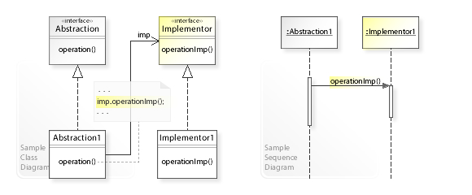

# Bridge pattern

## UML

## Definition

* Implementor
  * An interface which define the business operations
* Implementor1
  * Implements the Implementor interface, which run the actual business related operations.
* Abstraction
  * A bridge between the `Client` and the `Implementor` interface
  * Holding a reference to the implementor
  * Hiding the actual implementor from the client (invoker)
  * The actual operations could be switched at runtime by changing the reference of the implementor
* Abstraction1
  * Inherit from the `Abstraction` class
  * Refer to different `Implementor` to provide dynamic business operations
* Client
  * The client (invoker) which need run the business operations
  * The client do not refer to the `Implementor` interface, but referring to the `Abstraction` class instead. By referring the bridge class, client could change the behavior at runtime.

## Acknowlege

* UML image reference from [Wikipedia bridge pattern](https://en.wikipedia.org/wiki/Bridge_pattern)
