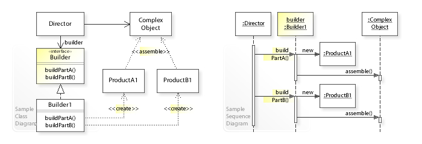

# Builder pattern

## UML

## Participants

* Builder
    - specifies an abstract interface for creating parts of a Product object.
* ConcreteBuilder
    - constructs and assembles parts of the product by implementing the Builder interface.
    - defines and keeps track of the representation it creates. 
    - provides an interface for retrieving the product
* Director
    - constructs an object using the Builder interface.
* Product
    - represents the complex object under construction. ConcreteBuilder builds the product's internal representation and defines the process by which it's assembled.
    - includes classes that define the constituent parts, including interfaces for assembling the parts into the final result.

## Acknowlege

* UML image reference from [Wikipedia builder pattern](https://en.wikipedia.org/wiki/Builder_pattern)
* Participants reference from [Design patterns GoF]
