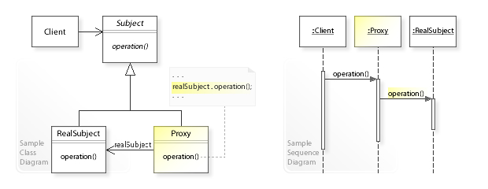

# Proxy pattern

## UML

## Definition

`Proxy pattern` is used when client need to get more access control to the `Subject` interface. 

For example, client need to access the internet, we need to allow the client could only access some websites, and deny for others. We can apply `Proxy pattern` to wrap the internet access interface, and add a rule engine before invoking the internet access methods.

* Subject
  * Defining business related operations interface
* RealSubject
  * A class implement the `Subject` interface
* Proxy
  * A wrapper class implement the `Subject` interface, and holding a reference to the `RealSubject` and delegate the operations to the `RealSubject`.
  * Add user defined logic to the `Operaiton` method
  * Have more control to the access right to the `RealSubject`.
  * In the point of view of `Client`, it only holding a reference to the `Subject` interface, and can't tell when it is referring to the `RealSubject` or the `Proxy` object.

## Acknowlege

* UML image reference from [Wikipedia proxy pattern](https://en.wikipedia.org/wiki/Proxy_pattern)
