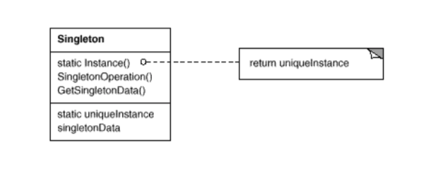

# Singleton pattern

## UML

## Participants

* Singleton
    - defines an Instance operation that lets clients access its uniqueinstance. Instance is a class operation (that is, a class method in Smalltalk and a static member function in C++).
    - may be responsible for creating its own unique instance.

## Acknowlege

* UML image from book [Design pattern Gof]
* Participants reference from [Design patterns GoF]
